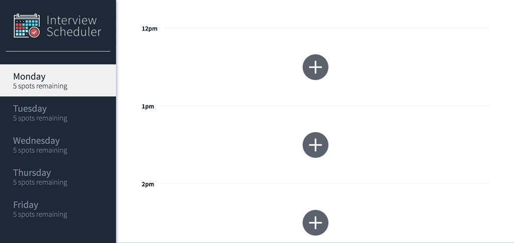
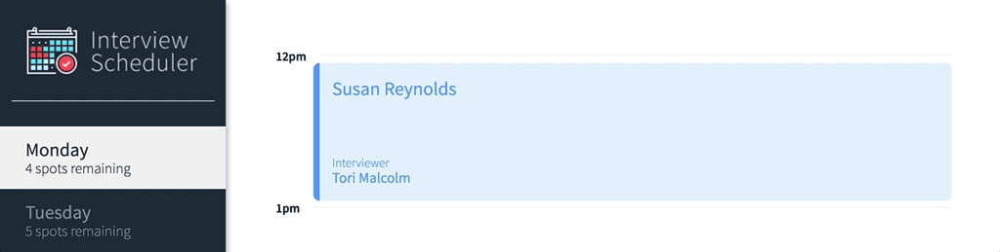

# Interview Scheduler
 I build and test a single page React application that allows users to book and cancel interviews. I combine a concise API with a WebSocket server to build a realtime experience.

 ## Create an Interview


 ## Delete an Interview


## Edit and Interview


## Handling Error



## Setup

Install dependencies with `npm install`.

## Running Webpack Development Server

```sh
npm start
```

## Running Jest Test Framework

```sh
npm test
```

## Running Storybook Visual Testbed

```sh
npm run storybook
```
## Technical Specifications
- React
- Webpack, Babel
- Axios, WebSockets
- Axios
- Storybook, Webpack Dev Server, Jest, Testing Library


