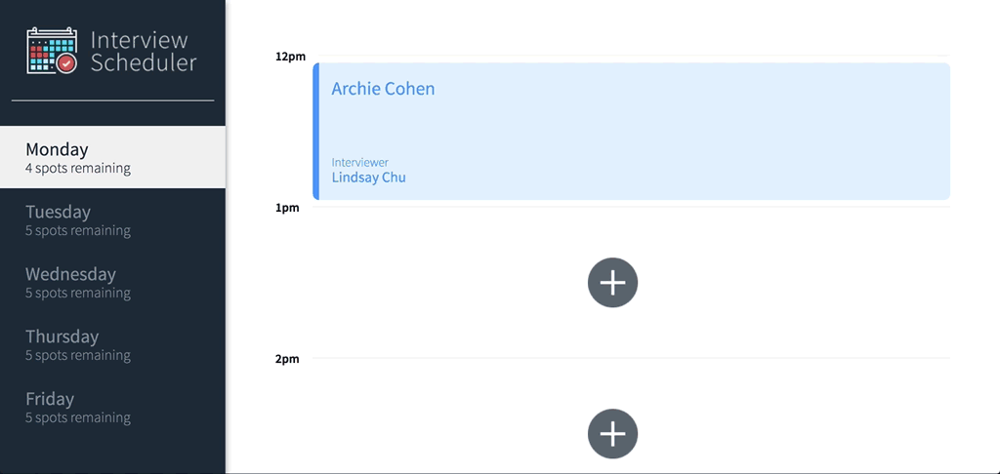

# Interview Scheduler
 I build and test a single page React application that allows users to book and cancel interviews. I combine a concise API with a WebSocket server to build a realtime experience.
 ## Delete an Interview

## Edit and Interview

## Setup

Install dependencies with `npm install`.

## Running Webpack Development Server

```sh
npm start
```

## Running Jest Test Framework

```sh
npm test
```

## Running Storybook Visual Testbed

```sh
npm run storybook
```
